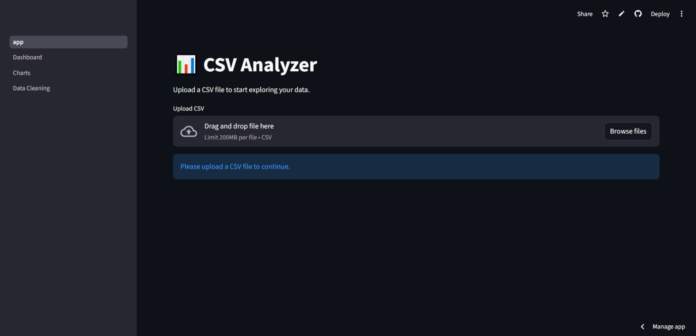

# CSV Data Dashboard 📊

A multi‑page Streamlit application for uploading, exploring, visualizing, and cleaning CSV datasets.  
The dashboard provides an intuitive interface for data preview, filtering, chart creation, and basic data cleaning — ideal for quick analysis and exploratory data work.

---

## ✨ Features

### 📁 CSV Upload
- Upload any CSV file up to several MB
- Automatic delimiter detection
- Displays file info and dataset shape

### 👀 Data Preview
- View the first rows of the dataset
- Toggle column visibility
- Inspect data types and missing values

### 🔍 Filtering Tools
- Filter by numeric ranges
- Filter by categories
- Apply multiple conditions at once

### 📊 Interactive Charts
- Create line, bar, area, scatter, and pie charts
- Choose X/Y axes dynamically
- Auto‑generated Altair visualizations
- Responsive layout for all screen sizes

### 🧹 Data Cleaning
- Remove duplicates
- Drop missing values
- Fill missing values with mean/median/custom value
- Select and drop columns

### 📈 Summary Statistics
- Quick overview of numeric columns
- Min, max, mean, median, std
- Correlation matrix (optional)

### 🗂️ Multi‑Page Structure
- **Dashboard** — upload + preview  
- **Charts** — build visualizations  
- **Data Cleaning** — modify dataset  

### 💾 Session State Support
- Keeps your data while navigating pages
- Allows smooth workflow without re‑uploading

---

## 🚀 Live Demo
You can try the app here:  
[https://your-app-name.streamlit.ap](https://csv-dashboard-app-z2hdh3nv3zmpsjdwqlcqva.streamlit.app/)
## 📸 Screenshot

